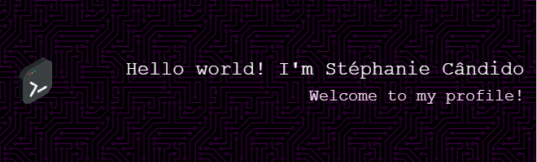

<!-- header image -->

***

<!-- gitHub profile views badge -->

  

<!-- about me section-->

  

    <ul>
      <li>💻🎓 Information systems undergrad @ UFRPE</li>
      <li>👩🏾‍💻🚀 Student @ Programadores do Amanhã</li>
      <li>📊💽 Learning data analysis @ Programaria</li>
      <li>📖🔎 Interests in development: <strong>Machine Learning Operations</strong> | <strong>Data Mining</strong></li>
    </ul>
  

  
  <!-- gif section -->
  

    
  

 

<!-- contact section -->

  <h3> how you can reach me</h3>

   
   
   

<!-- tech stack section -->
<h3> tech stack</h3>

  <!-- icons -->
  

 

<!-- github stats -->

  <!-- stats -->
  

  <!-- most used languages -->
  

 

<!-- message -->

  
I love meeting new people and sharing knowledge, so if you’d like to chat, feel free to reach out! :) 

<!-- pacman gif -->

  

